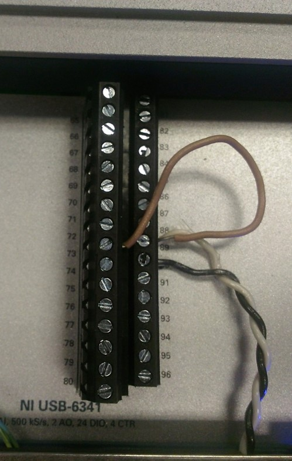
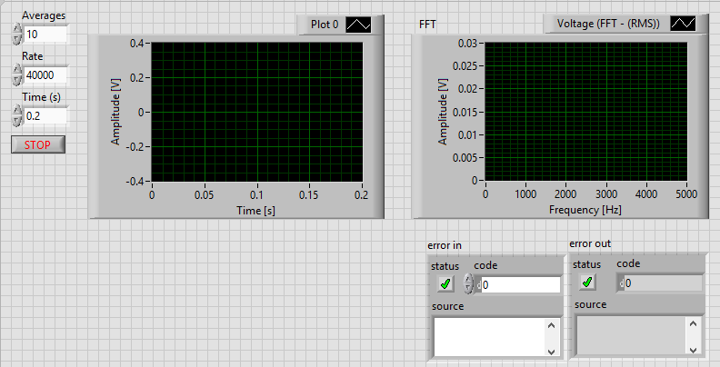

Previously, you developed an automated system to characterize the response of the Kundt’s tube to sound waves of known frequency. You generated a transmission spectrum of the tube by scanning the frequency of sound sent to a speaker at one end of the tube and measuring the average of the absolute value of the time varying amplitude of the sound recorded for a known time interval using a microphone at the other end of the tube.

Now, you will reconfigure the Kundt’s tube to measure its response to an impulse. You will observe that the tube exhibits a “ring down” behavior, something akin to the sound a bell makes when struck with a sharp blow. Fourier transformation of the ring down will generate the same spectrum of the Kundt’s tube.

The impulse response experiment is a specific case of the stimulus response experiment. Here, you will generate the impulse using the timer-counter facility of the DAQ board to produce a logic pulse of software selectable time duration. Then, at the end of the pulse you will acquire the sound-wave (pressure) response of the system using a microphone connected to the ADC. Connections are as described:

1. Connect the general-purpose counter #0 output (PFI 12) pin 89 on the box) and the digital ground (pin 90) to the speaker input of the audio amplifier box.

2. Also connect pin 89 to pin 73, for trigger.

3. For data acquisition, you should use pin 73 at falling edge of digital trigger.

Because the experiment is over so quickly, and so readily repeated, you will develop a facility in your VI to add many experiments together to improve the signal to noise ratio.

After averaging signals, you should also run Fourier transform over the averaged signal to get frequency spectrum. When you get the frequency spectrum, select the same frequency peak that you selected last week and analyze it using the fitter that you developed last week.

Needless to say, all of this should be done in a project container and you should save data as default.

Answer these questions in your pull request:

1. What is the effect of the pulse width on the experiment? Try settings like 0.1, 1.0, and 10 msec. Report your observations in your documentation.
2. What is the effect of the acquisition rate? Try settings like 1000, 10000 and 100000 points per sec. Also note what the minimum buffer size and scan rate is needed to describe the response up to 2000 Hz.
3. Try the effect of signal averaging on the appearance of the power spectrum. For this experiment, reduce the gain of the audio amplifier until the signal is barely detectable.
